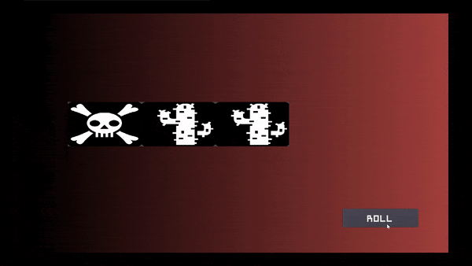

# Godot Slot Machine

Simple slot machine based on the [Godot engine](https://godotengine.org/).

Icons were copied from this [memory game](https://github.com/Tzoop/MemoryGame) and originate from [Game-Icons](https://game-icons.net/).

## Parameters
- array of pictures
- number of reels
- number of pictures per reel
- speed of the animation
- duration of the animation (does not include spin_up and spin_down time)
  - if set to 0, runs until stopped by user
- delay between individual reels

## Implementation
The slot machine consists of a number of spinning reels, each showing a number of pictures. We call the pictures _SlotTiles_, which are [Sprites](https://docs.godotengine.org/en/stable/classes/class_sprite.html) positioned in an N x M grid with randomly assigned textures based on a provided image list.

On start, each reel is spun with a pre-defined delay. A spin-up animation is played using the [AnimationPlayer](https://docs.godotengine.org/en/stable/classes/class_animationplayer.html) with a Bezier curve affecting the position of each tile. Afterwards, the SlotTiles are moved by one position at a time using [Tweens](https://docs.godotengine.org/en/stable/classes/class_tween.html) on the tiles' position. 
Instead of relying on timers for the movement, we count how often each reel moved. This allows us to define an exact number of movements for every time we run the slot machine. When the counter for a reel reaches the desired number of movements, we play a spin-down animation. In order to still define a runtime in seconds, we calculate the number of movements as `runtime * speed`. The speed is normalized to be independent of the number of tiles displayed.

The slot machine is enclosed in a [Viewport](https://docs.godotengine.org/en/stable/classes/class_viewport.html). When a moved SlotTile leaves the viewport we adjust its position to be above all other tiles and assign a new random texture. That way it looks as if an infinite stream of new pictures is running in from the top.

If we only display as many pictures as fit inside the viewport, moving the top most tile downwards would leave an empty slot during the animation which would only be filled when the animation is finished and the bottom most tile is repositioned to the top. In order to remove these artifacts, we add an extra tile above and below the viewport. If the spin-up animation moves the tiles farther than the tile_size, the number of extra tiles needs to be increased. We automatically compute the number of extra tiles required by `ceil(SPIN_UP_DISTANCE / tile_size.y) * 2`.

## Issues

Given that we move tiles by one grid position at a time, the maximum speed is limited by the framerate. At the same time, we notice movement jitter on slow speeds. In order to fix this, the movement would need to be computed in the _process function instead of using Tweens.

# License

Distributed under the MIT License. See `LICENSE` for more information.

Icons are licensed CC BY 3.0 [Game-Icons](https://game-icons.net/).

# Contact

Fabian Bolte - fabian.bolte@web.de
